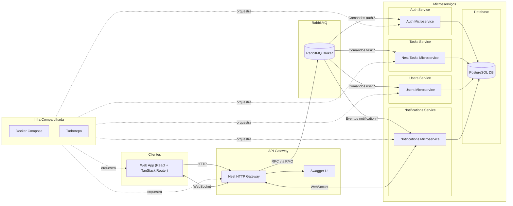

# 📋 coreTasks

> A modern, scalable task management system built with microservices architecture

[](https://opensource.org/licenses/MIT)
[](https://www.typescriptlang.org/)
[](https://nestjs.com/)
[](https://reactjs.org/)
[](https://www.docker.com/)

## 📖 Table of Contents

- [Overview](#overview)
- [Architecture](#architecture)
- [Technologies](#technologies)
- [Getting Started](#getting-started)
- [Project Structure](#project-structure)
- [Services](#services)
- [Development](#development)
- [Documentation](#documentation)
- [Contributing](#contributing)
- [Development Timeline](#️-development-timeline)

## 🌟 Overview

**coreTasks** is an enterprise-grade task management system designed with a microservices architecture. It leverages NestJS for backend services, React for the frontend, and RabbitMQ for inter-service communication, providing a robust, scalable, and maintainable solution for task management.

### Key Features

- 🔐 **Secure Authentication**: JWT-based authentication with access/refresh token strategy
- 📝 **Task Management**: Complete CRUD operations with status tracking, assignments, and history
- 👥 **User Management**: User profiles, roles, and permissions
- 🔔 **Real-time Notifications**: WebSocket-based notifications for instant updates
- 📊 **Activity Tracking**: Comprehensive audit trail for all task operations
- 🎨 **Modern UI**: Beautiful, responsive interface built with React and Shadcn UI
- 🚀 **Scalable Architecture**: Microservices design for horizontal scaling
- 🐳 **Docker Ready**: Fully containerized for easy deployment

## 🏗️ Architecture

coreTasks follows an **event-driven microservices architecture** with the following components:



### Communication Flow

1. **Client → API Gateway**: HTTP/REST requests
2. **API Gateway → Microservices**: RabbitMQ RPC (Request-Reply Pattern)
3. **Microservices → Database**: PostgreSQL (Shared Database)
4. **Microservices → Notifications**: RabbitMQ Events (Pub-Sub Pattern)
5. **Notifications → Client**: WebSocket (Real-time updates)

## 🛠️ Technologies

### Backend

- **[NestJS](https://nestjs.com/)** - Progressive Node.js framework
- **[TypeScript](https://www.typescriptlang.org/)** - Type-safe JavaScript
- **[TypeORM](https://typeorm.io/)** - ORM for database operations
- **[PostgreSQL](https://www.postgresql.org/)** - Relational database
- **[RabbitMQ](https://www.rabbitmq.com/)** - Message broker for microservices
- **[Passport.js](http://www.passportjs.org/)** - Authentication middleware
- **[JWT](https://jwt.io/)** - JSON Web Tokens for auth

### Frontend

- **[React 18](https://reactjs.org/)** - UI library
- **[Vite](https://vitejs.dev/)** - Build tool and dev server
- **[TanStack Router](https://tanstack.com/router)** - Type-safe routing
- **[Shadcn UI](https://ui.shadcn.com/)** - Beautiful component library
- **[TailwindCSS](https://tailwindcss.com/)** - Utility-first CSS
- **[Socket.IO Client](https://socket.io/)** - WebSocket client

### DevOps & Tools

- **[Docker](https://www.docker.com/)** & **Docker Compose** - Containerization
- **[Turbo](https://turbo.build/)** - Monorepo build system
- **[npm Workspaces](https://docs.npmjs.com/cli/v7/using-npm/workspaces)** - Monorepo package management
- **[Winston](https://github.com/winstonjs/winston)** - Logging
- **[Class Validator](https://github.com/typestack/class-validator)** - DTO validation

## 🚀 Getting Started

### Prerequisites

#### For local execution:
- **Node.js** >= 18.x
- **npm** >= 10.x
- **PostgreSQL** 14+
- **RabbitMQ** 3.11+

#### For Docker execution:
- **Docker** >= 20.x
- **Docker Compose** >= 2.x

---

## 🐳 Option 1: Docker Execution (Recommended)

This is the fastest way to run the complete project.

### 1. Clone the repository

```bash
git clone https://github.com/yourusername/coreTasks.git
cd coreTasks
```

### 2. Build Docker images

```bash
npm run docker:build
```

### 3. Start infrastructure (PostgreSQL + RabbitMQ)

```bash
npm run infra:up
```

Wait a few seconds to ensure the database is ready.

### 4. Run database migrations

```bash
npm run migration:run
```

### 5. Start backend services

```bash
npm run services:backend
```

### 6. Start web applications

```bash
npm run services:web
```

### ✅ Application is running!

Services will be available at:
- **API Gateway**: http://localhost:3000
- **Web App #1**: http://localhost:8080
- **Web App #2**: http://localhost:8081
- **RabbitMQ Management**: http://localhost:15672 (admin/admin)

---

## 💻 Option 2: Local Execution (Development)

For development with hot reload and easier debugging.

### 1. Clone the repository

```bash
git clone https://github.com/yourusername/coreTasks.git
cd coreTasks
```

### 2. Install dependencies

```bash
npm install
```

### 3. Start infrastructure via Docker

Even when running locally, it's easier to use Docker for PostgreSQL and RabbitMQ:

```bash
npm run infra:up
```

**Alternative**: If you prefer to install locally:
- PostgreSQL: Configure with user `postgres`, password `password`, database `coreTask`
- RabbitMQ: Configure with user `admin`, password `admin`

### 4. Run migrations

```bash
npm run migration:run
```

### 5. Start all services in development mode

```bash
npm run start:dev
```

This command starts all services with hot reload:
- **API Gateway**: http://localhost:3000
- **Auth Service**: http://localhost:3002
- **Notification Service**: http://localhost:3003
- **Task Service**: http://localhost:3001
- **User Service**: http://localhost:3004
- **Web App #1**: http://localhost:8080
- **Web App #2**: http://localhost:8081

### Run individual services

If you prefer to run only one service at a time:

```bash
# Backend services (NestJS)
cd apps/api-gateway
npm run start:dev

# Frontend (React)
cd apps/web
npm run dev
```

---
## 📁 Project Structure

```
coreTasks/
├── apps/
│   ├── api-gateway/              # HTTP Gateway (Port 3000)
│   ├── task-service/             # Task Microservice (Port 3001)
│   ├── user-service/             # User Microservice (Port 3004)
│   ├── auth-service/             # Auth Microservice (Port 3002)
│   ├── notification-service/     # Notification Microservice (Port 3003)
│   ├── web/                      # React Frontend (Ports 8080, 8081)
│   └── packages/
│       ├── types/                # Shared DTOs, Interfaces, Enums
│       ├── utils/                # Shared Utilities, Entities, Logger
│       └── tsconfig/             # Shared TypeScript Configs
├── docker-compose.yml            # Docker services configuration
├── turbo.json                    # Turbo build configuration
├── package.json                  # Root package.json
└── README.md                     # This file
```

## 🔧 Services

### [API Gateway](apps/api-gateway/README.md)
- **Port**: 3000
- **Role**: HTTP to RPC proxy
- **Responsibilities**:
  - Receives HTTP requests from frontend
  - Authenticates requests using JWT
  - Forwards to appropriate microservice via RabbitMQ
  - Returns responses to client

### [Task Service](apps/task-service/README.md)
- **Port**: 3001
- **Role**: Task management
- **Features**:
  - CRUD operations for tasks
  - Task assignments
  - Status management
  - Comments and history tracking

### [User Service](apps/user-service/README.md)
- **Port**: 3004
- **Role**: User management
- **Features**:
  - User profile management
  - User search and listing

### [Auth Service](apps/auth-service/README.md)
- **Port**: 3002
- **Role**: Authentication & Authorization
- **Features**:
  - User registration
  - Login/Logout
  - JWT token generation (Access + Refresh)
  - Password reset

### [Notification Service](apps/notification-service/README.md)
- **Port**: 3003
- **Role**: Real-time notifications
- **Features**:
  - WebSocket connections
  - Event-based notifications
  - Notification history

### [Web Application](apps/web/README.md)
- **Ports**: 8080, 8081
- **Role**: User interface
- **Tech**: React + Vite + TanStack Router + Shadcn UI

### [Shared Packages](apps/packages/)

#### [@taskscore/types](apps/packages/types/README.md)
Shared TypeScript types, DTOs, interfaces, enums, and RPC constants

#### [@taskscore/utils](apps/packages/utils/README.md)
Shared utilities: Logger, Database Client, RPC Client, TypeORM Entities

#### [@taskscore/tsconfig](apps/packages/tsconfig/README.md)
Shared TypeScript configurations

## 💻 Development

### Available Scripts

| Script | Description |
|--------|-------------|
| `npm run build` | Build all services |
| `npm run start:dev` | Start all services in development mode |
| `npm run docker:up` | Start all services in Docker |
| `npm run docker:up:build` | Build and start all services in Docker |
| `npm run docker:up:detached` | Start Docker services in background |
| `npm run docker:up:build:detached` | Build and start Docker services in background |

### Service-Specific Scripts

Navigate to any service directory (`apps/*/`):

```bash
# NestJS Services (api-gateway, *-service)
npm run build           # Compile TypeScript
npm run start           # Start production build
npm run start:dev       # Start with watch mode
npm run start:debug     # Start in debug mode
npm run test            # Run tests
npm run test:watch      # Run tests in watch mode
npm run test:cov        # Run tests with coverage

# Web App
npm run dev             # Start dev server
npm run build           # Build for production
npm run build:dev       # Build for development
npm run preview         # Preview production build
```

### Adding a New RPC Endpoint

Follow this pattern (detailed in [CLAUDE.md](CLAUDE.md)):

1. Define DTOs in `apps/packages/types/src/`
2. Add RPC message pattern to appropriate enum
3. Implement `@MessagePattern` handler in microservice
4. Add service method in microservice
5. Add HTTP endpoint in API Gateway
6. Add gateway service method using `sendRpc()`

Example:

```typescript
// 1. Define DTO (packages/types/src/taskDtos.ts)
export class CreateTaskDto {
  @IsString() title: string;
  @IsString() @IsOptional() description?: string;
}

// 2. Add RPC constant (packages/types/src/taskTypes.ts)
export enum TaskRequestsRPCMessage {
  CreateTask = 'tasks.create',
  // ...
}

// 3. Microservice handler (task-service/src/task.controller.ts)
@MessagePattern(TaskRequestsRPCMessage.CreateTask)
async createTask(@Payload() data: { payload: CreateTaskDto; traceId: string }) {
  return this.taskService.createTask(data.payload, data.traceId);
}

// 4. Gateway endpoint (api-gateway/src/modules/task/task.controller.ts)
@Post()
async create(@Body() dto: CreateTaskDto, @Req() req: Request) {
  return this.taskService.createTask(dto, req.user.id, req.traceId);
}

// 5. Gateway service (api-gateway/src/modules/task/task.service.ts)
async createTask(dto: CreateTaskDto, userId: string, traceId: string) {
  return sendRpc(this.client, TaskRequestsRPCMessage.CreateTask,
    { ...dto, userId }, traceId);
}
```

### Logging

All services use structured logging from `@taskscore/utils`:

```typescript
import { createLogger } from '@taskscore/utils';

const logger = createLogger({
  service: 'my-service',
  environment: process.env.NODE_ENV
});

logger.info('Operation started', { traceId, userId, ...metadata });
logger.error('Operation failed', { traceId, error: error.message });
```

### Error Handling

Use `ProblemDetail` format from `@taskscore/utils`:

```typescript
import { createProblemDetails } from '@taskscore/utils';
import { HttpStatus } from '@nestjs/common';

throw createProblemDetails({
  status: HttpStatus.NOT_FOUND,
  title: 'Resource not found',
  detail: 'Task with id X does not exist',
  traceId
});
```

## 📚 Documentation

- **[CLAUDE.md](CLAUDE.md)**: AI-assisted development guide with architecture patterns
- **[API Documentation](docs/api.md)**: REST API endpoints (Swagger/OpenAPI)
- **[Architecture Diagram](documentation/diagram.mermaid)**: System architecture visualization
- **Service READMEs**:
  - [API Gateway](apps/api-gateway/README.md)
  - [Task Service](apps/task-service/README.md)
  - [User Service](apps/user-service/README.md)
  - [Auth Service](apps/auth-service/README.md)
  - [Notification Service](apps/notification-service/README.md)
  - [Web App](apps/web/README.md)

## 🧪 Testing

```bash
# Run all tests
npm test

# Run tests with coverage
npm run test:cov

# Run e2e tests
npm run test:e2e

# Run tests in watch mode
npm run test:watch
```

## 🐳 Docker

### Services in docker-compose.yml

- **postgres**: PostgreSQL database (Port 5432)
- **rabbitmq**: Message broker (Ports 5672, 15672)
- **api-gateway**: HTTP Gateway (Port 3000)
- **task-service**: Task microservice
- **user-service**: User microservice
- **auth-service**: Auth microservice
- **notification-service**: Notification microservice
- **web-1, web-2**: React frontends (Ports 8080, 8081)

### Useful Docker Commands

```bash
# View logs
docker-compose logs -f [service-name]

# Restart a service
docker-compose restart [service-name]

# Stop all services
docker-compose down

# Remove volumes (⚠️ deletes data)
docker-compose down -v

# Rebuild a specific service
docker-compose up -d --build [service-name]
```

## 🔐 Environment Variables

Key environment variables (see `.env.example` in each service):

### Database
- `DB_HOST`: PostgreSQL host (default: localhost)
- `DB_PORT`: PostgreSQL port (default: 5432)
- `DB_USERNAME`: Database user (default: postgres)
- `DB_PASSWORD`: Database password (default: password)
- `DB_NAME`: Database name (default: coreTask)

### RabbitMQ
- `RABBITMQ_URL`: RabbitMQ connection URL (default: amqp://localhost:5672)
- `RABBITMQ_USER`: RabbitMQ user (default: admin)
- `RABBITMQ_PASS`: RabbitMQ password (default: admin)

### JWT
- `JWT_ACCESS_SECRET`: Secret for access tokens
- `JWT_ACCESS_EXPIRES_IN`: Access token expiration (default: 15m)
- `JWT_REFRESH_SECRET`: Secret for refresh tokens
- `JWT_REFRESH_EXPIRES_IN`: Refresh token expiration (default: 7d)

### Service Ports
- `API_GATEWAY_PORT`: API Gateway port (default: 3000)
- `TASK_SERVICE_PORT`: Task service port (default: 3001)
- `AUTH_SERVICE_PORT`: Auth service port (default: 3002)
- `NOTIFICATION_SERVICE_PORT`: Notification service port (default: 3003)
- `USER_SERVICE_PORT`: User service port (default: 3004)

## 🤝 Contributing

We welcome contributions! Please follow these steps:

1. **Fork the repository**
2. **Create a feature branch** (`git checkout -b feature/amazing-feature`)
3. **Write tests** for new features
4. **Commit your changes** (`git commit -m '✨ Add amazing feature'`)
5. **Push to the branch** (`git push origin feature/amazing-feature`)
6. **Open a Pull Request**

### Coding Standards

- Follow NestJS and React best practices
- Use TypeScript strict mode
- Write meaningful commit messages (Conventional Commits)
- Ensure tests pass before submitting PR
- Update documentation for new features

### Commit Message Format

```
<type>(<scope>): <subject>

<body>

<footer>
```

Types: `feat`, `fix`, `docs`, `style`, `refactor`, `test`, `chore`

Example:
```
feat(task-service): add task assignment feature

- Add assignment endpoints
- Update task entity with assignees
- Add notification on assignment

Closes #123
```

## ⏱️ Development Timeline

The **coreTasks** project was developed in **14 days**, following an agile and iterative methodology. Below is the breakdown of time invested in each module:

### Overview
- **Total Timeline**: 14 days
- **Status**: ✅ Completed within deadline
- **Architecture**: Microservices with Event-Driven Design

### Time per Module

| Module | Estimated Time | Complexity | Main Challenges |
|--------|----------------|------------|-----------------|
| **Infrastructure & Setup** | 1-2 days | 🟡 Medium | Docker, RabbitMQ, PostgreSQL, Monorepo configuration |
| **Shared Packages** (@taskscore/*) | 1 day | 🟢 Low | DTOs, Types, Logger, shared utilities |
| **Auth Service** | 1.5-2 days | 🟡 Medium | JWT (Access/Refresh), Passport.js, Guards |
| **User Service** | 1-1.5 days | 🟢 Low | User CRUD, profiles, search |
| **Task Service** | 2-3 days | 🔴 High | Task CRUD, assignments, comments, history tracking |
| **Notification Service** | 1.5-2 days | 🟡 Medium | WebSocket, Event listeners, real-time updates |
| **API Gateway** | 1.5-2 days | 🟡 Medium | HTTP → RPC proxy, authentication, rate limiting |
| **Web Application** | 3-4 days | 🔴 High | React UI, TanStack Router, Shadcn UI, WebSocket client |
| **Integration & Testing** | 1-2 days | 🟡 Medium | E2E tests, debugging, RPC communication adjustments |
| **Documentation** | 0.5-1 day | 🟢 Low | README, diagram.mermaid, api.openapi.yaml |

### Development Timeline

```
Day 1-2:   🏗️  Infrastructure setup (Docker, DB, RabbitMQ, Monorepo)
Day 2-3:   📦  Shared packages and base service structure
Day 3-5:   🔐  Auth Service + User Service
Day 5-8:   📝  Task Service (most complex module)
Day 8-9:   🔔  Notification Service + WebSocket
Day 9-10:  🚪  API Gateway + RPC Integration
Day 10-13: 🎨  Web Application (UI, routing, state management)
Day 13-14: ✅  Testing, refinements, and documentation
```

### Project Metrics

- **Total Services**: 5 microservices + 1 gateway + 1 frontend
- **Total Lines of Code**: ~15,000+ lines
- **Integrated Technologies**: 15+ (NestJS, React, RabbitMQ, PostgreSQL, etc.)
- **REST Endpoints**: 30+
- **RPC Patterns**: 25+
- **UI Components**: 40+

### Lessons Learned

1. **Microservices require careful planning**: RPC communication via RabbitMQ required standardization from the start
2. **Shared packages save time**: Investing in shared packages reduced code duplication
3. **TypeScript is essential**: Type-safety prevented many bugs during development
4. **Docker facilitates development**: Consistent environments accelerated the process
5. **Continuous documentation**: Keeping docs updated during development avoided rework

### Next Steps (Post-14 days)

- [ ] Implement Redis caching
- [ ] Add comprehensive E2E tests
- [ ] Set up CI/CD pipeline
- [ ] Implement advanced rate limiting
- [ ] Add observability (Prometheus, Grafana)
- [ ] Implement feature flags
- [ ] Add internationalization support (i18n)

## 📄 License

This project is licensed under the MIT License - see the [LICENSE](LICENSE) file for details.

## 👥 Authors

- **Your Name** - *Initial work* - [YourGitHub](https://github.com/yourusername)

## 🙏 Acknowledgments

- NestJS team for the amazing framework
- React team for the UI library
- All contributors and maintainers

---

<p align="center">Made with ❤️ by the coreTasks Team</p>
<p align="center">
  <a href="https://github.com/yourusername/coreTasks">⭐ Star this repo</a> •
  <a href="https://github.com/yourusername/coreTasks/issues">🐛 Report Bug</a> •
  <a href="https://github.com/yourusername/coreTasks/issues">💡 Request Feature</a>
</p>
